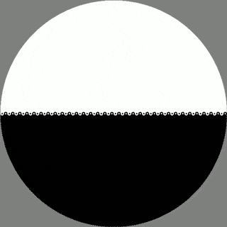

# Taichi Pattern

## Run
```
Taichi(Python) Version:
>> cd Source
>> python Main.py

C++ Version:
>> cd Source
>> g++ Main.cpp -IPathToStbImage && a.exe
The C++ version is not parallel or in real time, it's just to verify the algorithm
```

## The Definition of Taichi Pattern
| Static | Rotating |
:-:|:-:
|  |  |

## Do Some Change
### 1. Add Sub Pattern
| Add Sub Pattern | Change Speed | N = 10 |
:-:|:-:|:-:
|  |  |  |
### 2. Change Sub Patterns' Size
| Change Size: 80% | Change Ratio with Time |
:-:|:-:
|  |  |
### 3. Change Sub Patterns' Rotation Direction
| Rotate in the Opposite Dir | N = 6; Ratio = 1.0 |
:-:|:-:
|  |  |
